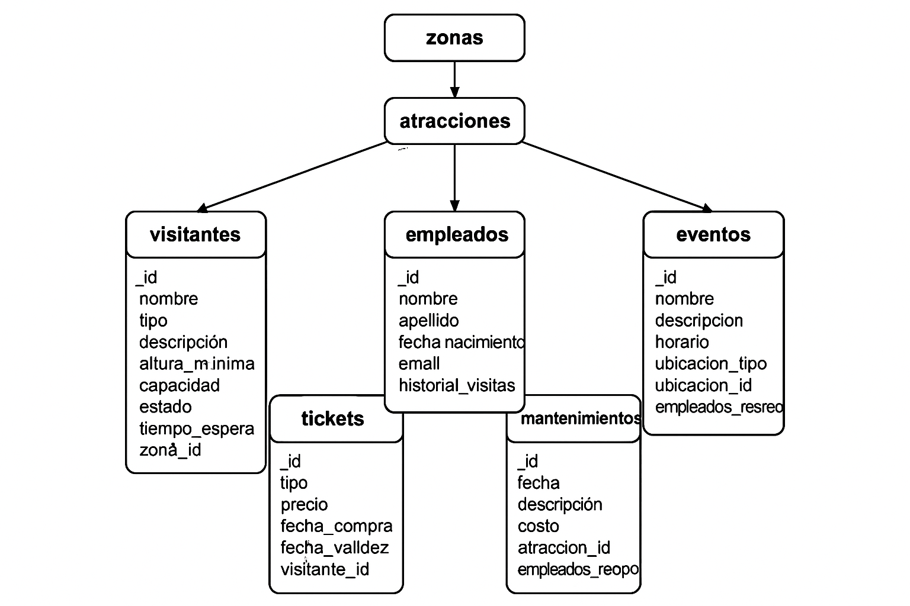
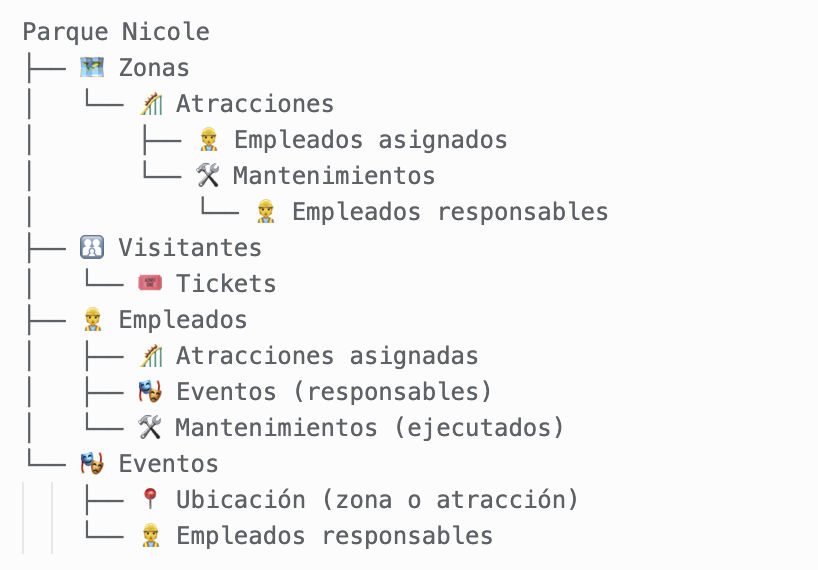

# 🎢 Parque Nicole - Diseño de Base de Datos NoSQL (MongoDB)

## 👥 Integrantes
- Juan David Bermeo Castro  
- Carlos Daniel Arauz  
---

## 📘 Introducción

Este proyecto modela una base de datos NoSQL en **MongoDB** para el **Parque Nicole**, un parque de diversiones que necesita administrar su información de atracciones, visitantes, empleados, tickets, eventos y mantenimiento.

Se aplican dos estrategias fundamentales del diseño NoSQL:
- **Incrustación (embedding):** cuando los datos están fuertemente relacionados y son estáticos.
- **Referencias (referencing):** cuando las entidades pueden cambiar frecuentemente, crecer, o se comparten entre múltiples documentos.

La elección entre estas estrategias se justifica para optimizar consultas, minimizar redundancia y asegurar escalabilidad.
---

## 🧩 Diagrama del Modelo de Datos




## 🌐 Representación Gráfica (Árbol Simplificado)



## 🧩 Esquema Relacional de Colecciones (Texto)

- `zonas`
  - ↪ Relación 1:N con `atracciones` (referenciada desde `atracciones.zona_id`)

- `atracciones`
  - ↪ Relación N:1 con `zonas`
  - ↔ Relación N:M con `empleados` (referencia cruzada desde `empleados.atracciones_asignadas`)
  - ↪ Relación 1:N con `mantenimientos`

- `visitantes`
  - ↪ Relación 1:N con `tickets` (referenciada desde `tickets.visitante_id`)

- `tickets`
  - ↪ Relación N:1 con `visitantes`

- `empleados`
  - ↔ Relación N:M con `atracciones`
  - ↔ Relación N:M con `eventos`
  - ↔ Relación N:M con `mantenimientos`

- `eventos`
  - ↪ Relación 1:1 con `zonas` o `atracciones` (según `ubicacion_tipo`)
  - ↔ Relación N:M con `empleados`

- `mantenimientos`
  - ↪ Relación N:1 con `atracciones`
  - ↔ Relación N:M con `empleados`

# 📊 Modelo de Datos por Colección
---

## 📂 `zonas`

### 📌 Atributos:
- `_id: ObjectId`
- `nombre: String`
- `descripcion: String`

### 🔁 Relaciones:
- Zona → Atracciones (1:N)

### 🧠 Estrategia: Referencia (desde `atracciones`)
### ✅ Justificación:
No se incrustan atracciones porque:
- Cambian de zona frecuentemente.
- Se deben consultar de forma independiente.

### 🧾 Ejemplo JSON:
```json
{
  "_id": { "$oid": "665fcaea8b5e4d3b4e0a01a1" },
  "nombre": "Zona Aventura",
  "descripcion": "Área dedicada a emociones extremas."
}
```
⸻

## 📂 atracciones

### 📌 Atributos:
	•	_id: ObjectId
	•	nombre: String
	•	tipo: String (montaña rusa, carrusel, show, etc.)
	•	descripcion: String
	•	altura_minima: Number
	•	capacidad: Number
	•	estado: String (operativa, mantenimiento)
	•	tiempo_espera: Number
	•	zona_id: ObjectId

### 🔁 Relaciones:
	•	Atracción → Zona (N:1)

### 🧠 Estrategia: Referencia

### ✅ Justificación:
Evita duplicación. Las zonas se consultan por separado.

### 🧾 Ejemplo JSON:
```json
{
  "_id": { "$oid": "665fcaea8b5e4d3b4e0a01f9" },
  "nombre": "Montaña Rusa Veloz",
  "tipo": "Montaña Rusa",
  "descripcion": "Una experiencia de velocidad extrema.",
  "altura_minima": 1.2,
  "capacidad": 24,
  "estado": "operativa",
  "tiempo_espera": 30,
  "zona_id": { "$oid": "665fcaea8b5e4d3b4e0a01a1" }
}
```
⸻

## 📂 visitantes

### 📌 Atributos:
	•	_id: ObjectId
	•	nombre: String
	•	apellido: String
	•	fecha_nacimiento: Date
	•	email: String
	•	historial_visitas: [Date]

### 🔁 Relaciones:
	•	Visitante → Tickets (1:N)

### 🧠 Estrategia: Referencia (en tickets)

### ✅ Justificación:

Los tickets crecen con el tiempo. Referenciarlos evita inflar el documento visitante.

### 🧾 Ejemplo JSON:
```json
{
  "_id": { "$oid": "665fcb6e8b5e4d3b4e0a031c" },
  "nombre": "Ana",
  "apellido": "Ramírez",
  "fecha_nacimiento": "1995-06-10T00:00:00Z",
  "email": "ana.ramirez@example.com",
  "historial_visitas": ["2024-01-01", "2024-06-10"]
}
```
⸻

## 📂 tickets

### 📌 Atributos:
	•	_id: ObjectId
	•	tipo: String (diario, anual, VIP)
	•	precio: Number
	•	fecha_compra: Date
	•	fecha_validez: Date
	•	visitante_id: ObjectId

### 🔁 Relaciones:
	•	Ticket → Visitante (N:1)

### 🧠 Estrategia: Referencia

### ✅ Justificación:
Permite consultar tickets independientemente. Soporta métricas, filtrado por tipo, fechas, etc.

### 🧾 Ejemplo JSON:
```json
{
  "_id": { "$oid": "665fcbe28b5e4d3b4e0a04b3" },
  "tipo": "anual",
  "precio": 120.00,
  "fecha_compra": "2024-01-01T00:00:00Z",
  "fecha_validez": "2024-12-31T00:00:00Z",
  "visitante_id": { "$oid": "665fcb6e8b5e4d3b4e0a031c" }
}
```
⸻

## 📂 empleados

### 📌 Atributos:
	•	_id: ObjectId
	•	nombre: String
	•	apellido: String
	•	cargo: String
	•	horario_trabajo: String
	•	atracciones_asignadas: [ObjectId]

### 🔁 Relaciones:
	•	Empleado ↔ Atracciones (N:M)

### 🧠 Estrategia: Referencia

### ✅ Justificación:
Permite reasignar empleados fácilmente sin duplicar información.

### 🧾 Ejemplo JSON:
```json
{
  "_id": { "$oid": "665fcbf98b5e4d3b4e0a051e" },
  "nombre": "Laura",
  "apellido": "Gómez",
  "cargo": "Operadora",
  "horario_trabajo": "09:00 - 17:00",
  "atracciones_asignadas": [
    { "$oid": "665fcaea8b5e4d3b4e0a01f9" }
  ]
}
```
⸻


## 📂 eventos

### 📌 Atributos:
	•	_id: ObjectId
	•	nombre: String
	•	descripcion: String
	•	horario: Date
	•	ubicacion_tipo: String (zona o atraccion)
	•	ubicacion_id: ObjectId
	•	empleados_responsables: [ObjectId]

### 🔁 Relaciones:
	•	Evento → Zona o Atracción (1:1)
	•	Evento → Empleados (N:M)

### 🧠 Estrategia: Referencia

### ✅ Justificación:
Permite independencia y reutilización. Soporta cambios de horario, ubicación y personal.

### 🧾 Ejemplo JSON:
```json

{
  "_id": { "$oid": "665fcc548b5e4d3b4e0a062b" },
  "nombre": "Show de Magia Nocturno",
  "descripcion": "Espectáculo para toda la familia",
  "horario": "2024-07-15T20:00:00Z",
  "ubicacion_tipo": "zona",
  "ubicacion_id": { "$oid": "665fcaea8b5e4d3b4e0a01a1" },
  "empleados_responsables": [
    { "$oid": "665fcbf98b5e4d3b4e0a051e" }
  ]
}
```
⸻

## 📂 mantenimientos

### 📌 Atributos:
	•	_id: ObjectId
	•	fecha: Date
	•	descripcion: String
	•	costo: Number
	•	atraccion_id: ObjectId
	•	empleados: [ObjectId]

## 🔁 Relaciones:
	•	Mantenimiento → Atracción (N:1)
	•	Mantenimiento → Empleados (N:M)

### 🧠 Estrategia: Referencia

### ✅ Justificación:
Necesario para trazabilidad y consultas históricas. Evita duplicaciones.

### 🧾 Ejemplo JSON:
```json
{
  "_id": { "$oid": "665fccc98b5e4d3b4e0a07d2" },
  "fecha": "2024-04-20T00:00:00Z",
  "descripcion": "Cambio de frenos en la montaña rusa",
  "costo": 5000,
  "atraccion_id": { "$oid": "665fcaea8b5e4d3b4e0a01f9" },
  "empleados": [
    { "$oid": "665fcbf98b5e4d3b4e0a051e" }
  ]
}
```
⸻

## 🚀 Instrucciones de Uso
Importar documentos usando mongoimport:

mongoimport --db parque_nicole --collection visitantes --file visitantes.json --jsonArray
mongoimport --db parque_nicole --collection atracciones --file atracciones.json --jsonArray
...
⸻